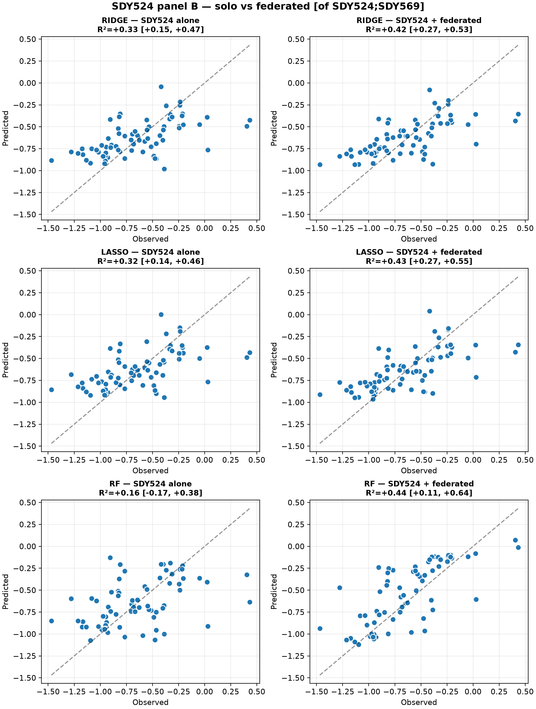
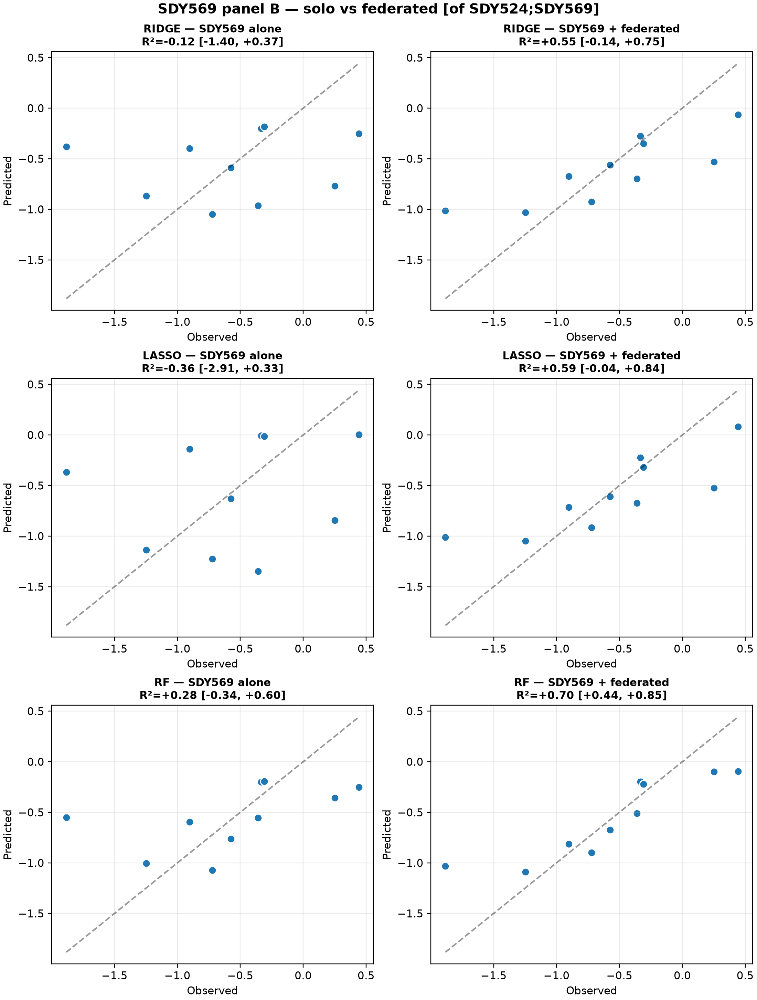

# oadr-cpep-fed-predict-site-nf

This package follows the [Elements of Style in Biomedical Workflow Creation in the Era of Agentic AI](https://science-and-technology-consulting-llc.github.io/elements-of-style-lessons/) Expected Springer-Verlag Fall 2026.

This particular [Nextflow](nextflow.io) workflow was built to illustrate the benefits of federation of data in a privacy preserving manner.  In the case of human data, data for privacy reasons as well (as size and scope) cannot move.  Computation moves to the data.  Federation can permit consensus and aggregation.  Aggregation of coefficients across studies may improve prediction.  

This **oadr-cpep-fed-predict-site-nf** [Nextflow](nextflow.io) workflow uses all the feature and selection features.  The results then will be used by the separate **[oadr-cpep-fed-predict-aggregation-nf](https://github.com/NIH-NLM/oadr-cpep-fed-aggregation-nf)** [Nextflow](nextflow.io) workflow to either build a consensus set of features or to aggregate the coefficients.

Finally, this **oadr-cpep-fed-predict-site-nf** will apply the results from the **[oadr-cpep-fed-predict-aggregation-nf](https://github.com/NIH-NLM/oadr-cpep-fed-aggregation-nf)** aggregation of coefficients to try to build a better prediction model.

## Three Steps in the Nextflow workflow building for Federation Pattern

1. Build or obtain the algorithm while splitting the steps in the algorithm into single-process command-line accessible arguments
2. Build the site specific workflow for selecting features and applying consensus and aggregated coefficients
3. Build the consensus and aggregation workflow
   
### Step 1 - [oadr-cpep](https://github.com/NIH-NLM/oadr-cpep) 

After designing the algorithm, a python package, [oadr-cpep](https://github.com/NIH-NLM/oadr-cpep) was created.  This particular python package builds three prediction models for the C-Peptide AUC for these provided studies, a LASSO model, a Ridge Regression Model and a Random Forest model.  The studies used are from the [ImmPort Shared Database](https://www.immport.org/shared/home).  The selected studies had both autoantibody data collected, demographics as well as the metric of 4-hour C-peptide AUC, which is used to determine the amount of remaining beta-cells in the pancreas.  Important metric when it comes to intervention possibilities in the case of Type 1 Diabetes.  

### Step 2 - [oadr-cpep-fed-predict-site-nf](https://github.com/NIH-NLM/oadr-cpep-fed-predict-site-nf)

This package is the site specific package that executes the feature selection steps, model building and after consensus and aggregation applies the hopefully improved coefficients.

### Step 3 - [oadr-cpep-fed-predict-aggregation-nf](https://github.com/NIH-NLM/oadr-cpep-fed-aggregation-nf)

The consensus and aggregation happens separately as it will combine one to many vectors to create a consensus set of features and/or aggregation of coefficients.  

## Execution

There are 4 steps in the execution, 3 steps happen with the site-specific workflow, 1 step happens with the separate aggregation workflow:

1. Select features  [oadr-cpep-fed-predict-site-nf](https://github.com/NIH-NLM/oadr-cpep-fed-predict-site-nf)
2. Build models  [oadr-cpep-fed-predict-site-nf](https://github.com/NIH-NLM/oadr-cpep-fed-predict-site-nf)
3. Obtain consensus and/or aggregate coefficients [oadr-cpep-fed-predict-aggregation-nf](https://github.com/NIH-NLM/oadr-cpep-fed-aggregation-nf)
4. Apply results  [oadr-cpep-fed-predict-site-nf](https://github.com/NIH-NLM/oadr-cpep-fed-predict-site-nf)

In the case of this design pattern, both these separate workflows use the same python package, oadr-cpep

## Illustration

## Example run with [ImmPort](https://www.immport.org/shared/home) data 

This example assumes that the three packages have been made accessible.  If running on the **[ADAPTS](https://www.autoimmuneinstitute.org/wp-content/smush-avif/2026/02/Congressional-Directive-6-ADAPTS-OADR-GAI.png.avif)** platform, these data are accessible within the platform in S3 buckets. 

Here we assume that a user has cloned the [oadr-cpep](https://github.com/NIH-NLM/oadr-cpep) repository and installed according to the instructions above (## Test locally on a Mac (no Docker)).

The first step is to run and fit the three models, LASSO (which is the means by which features are selected zeroing out features of no utility and saving these as selected features), Ridge regression and Random Forest.

These steps assume you have clone all three of the repositories and this particular example was run locally on a Mac (Apple MP3 Pro, 36 GB Ram, Tahoe 26.5.1).

### Step 1 - clone the repositories

```bash
git clone https://github.com/NIH-NLM/oadr-cpep.git
git clone https://github.com/NIH-NLM/oadr-cpep-fed-predict-site-nf.git
git clone https://github.com/NIH-NLM/oadr-cpep-fed-aggregation-nf.git
```

### Step 2 - set up the environment and build locally the python package

In general, it is best to have a clean environment where you will build and execute the core-python package locally with each of the Nextflow workflows.

For both of the Nextflow workflows, they can use the same environment that is built for the oadr-cpep-fed-predict-site-nf workflow - so we will build this environment and then build the oadr-cpep python package for our local test.  Note I change directory (cd) into the directory where I have cloned the repository.

```bash
cd oadr-cpep-fed-predict-site-nf
conda env create -f environment.yml
conda activate oadr-cpep-nf
```

After activating the environment that will be used to execute both of the Nextflow workflows, we need to install the python package, oadr-cpep, that we will be using.
Note that it is in a different directory but if the clone steps were followed as above, these steps will work as we will do a local navigation.
Note that I change directory to install the oadr-cpep package and then I return to the oadr-cpep-fed-predict-site-nf directory to ready myself for the execution.

```bash
cd ../oadr-cpep
pip install -e .
cd ../oadr-cpep-fed-predict-site-nf
```
### Step 3 - execute the site-specific workflow

This first workflow selects features and builds the model.   Somewhat artificial, as we are simulating federation, we will build models for two studies, SDY524 and SDY569.  In practice this will be done on the ADAPTS platform within each of the separate institutional workspaces.  No data shared, only coefficients.  But we are testing locally.

#### ImmPort SDY524 data

```bash
nextflow run main.nf -profile local \
--site SDY524 \
--panel B \
--aa           ../oadr-cpep/data/aa_524.csv \
--demo         ../oadr-cpep/data/demo_524.csv \
--cpeptide     ../oadr-cpep/data/SDY524_cpeptide_auc_tidy.csv \
--arms         ../oadr-cpep/data/SDY524_arm_or_cohort.txt \
--arm_subjects ../oadr-cpep/data/SDY524_arm_2_subject.txt
```
#### ImmPort SDY569 data

```bash
nextflow run main.nf -profile local \
--site SDY569 \
--panel B \
--aa           ../oadr-cpep/data/aa_569.csv \
--demo         ../oadr-cpep/data/demo_569.csv \
--cpeptide     ../oadr-cpep/data/SDY569_cpeptide_auc_tidy.csv \
--arms         ../oadr-cpep/data/SDY569_arm_or_cohort.txt \
--arm_subjects ../oadr-cpep/data/SDY569_arm_2_subject.txt
```
### Building models for SDY569 data using SDY524 features

To use the selected features from SDY524 on SDY569, and assuming the results have just been run through the command above.

```bash
nextflow run main.nf -profile local \
--site SDY569 \
--panel B \
--aa           ../oadr-cpep/data/aa_569.csv \
--demo         ../oadr-cpep/data/demo_569.csv \
--cpeptide     ../oadr-cpep/data/SDY569_cpeptide_auc_tidy.csv \
--arms         ../oadr-cpep/data/SDY569_arm_or_cohort.txt \
--arm_subjects ../oadr-cpep/data/SDY569_arm_2_subject.txt \
--features     results/SDY524_panelB_selected_features.csv
```

### Step 4 - Aggregating Coefficients

Now we have vectors for each of the models (pkl files for the Random Forest example, where we create a union of Random Forest).

Now we are going to step over to the [oadr-cpep-fed-aggregation-nf](https://github.com/NIH-NLM/oadr-cpep-fed-predict-aggregation-nf) directory and aggregate our coefficients (and union the forests for the random forest algorithm)

To do this, we created a `vectors.csv` that contains the relative path information to our results from `**Steps 1-4**`.

Let's navigate to the aggregation directory:

```bash
cd ../oadr-cpep-fed-predict-aggregation-nf
```

As I said, this step requires a `vectors.csv` file, which looks like this:
```bash
file
../oadr-cpep-fed-predict-site-nf/results/SDY524_from-SDY524_panelB_lasso_vector.csv
../oadr-cpep-fed-predict-site-nf/results/SDY524_from-SDY524_panelB_ridge_vector.csv
../oadr-cpep-fed-predict-site-nf/results/SDY524_from-SDY524_panelB_rf.pkl
../oadr-cpep-fed-predict-site-nf/results/SDY569_from-SDY524_panelB_lasso_vector.csv
../oadr-cpep-fed-predict-site-nf/results/SDY569_from-SDY524_panelB_ridge_vector.csv
../oadr-cpep-fed-predict-site-nf/results/SDY569_from-SDY524_panelB_rf.pkl
```

Note the first line is **file** this is required.

And now we execute the aggregation (the routine, remember is in the oadr-cpep python package itself, accessible in the Nextflow workflow through modules and access to the CLI.

```bash
nextflow run aggregate.nf -profile local \
--aggregation fedavg \
--sheet vectors.csv
```

This deposits the following files in the local **results** directory relative to our `oadr-cpep-fed-predict-aggregation-nf` directory.
A quick `ls -l` shows us the following content:

```bash
ls -l results 
federated_from-SDY524_panelB_lasso_fedavg_vector.csv
federated_from-SDY524_panelB_rf_union.pkl
federated_from-SDY524_panelB_ridge_fedavg_vector.csv
```

### Step 5 - Apply federated results

Ok last step -- now we want to apply these federated results -- to do this we go back to our site directory.

```bash
cd ../oadr-cpep-fed-predict-site-nf
```
First to **SDY524**
```bash
nextflow run main.nf -profile local \
--site SDY524 \
--panel B \
--aa            ../oadr-cpep/data/aa_524.csv \
--demo          ../oadr-cpep/data/demo_524.csv \
--cpeptide      ../oadr-cpep/data/SDY524_cpeptide_auc_tidy.csv \
--arms          ../oadr-cpep/data/SDY524_arm_or_cohort.txt \
--arm_subjects  ../oadr-cpep/data/SDY524_arm_2_subject.txt \
--federated_ridge ../oadr-cpep-fed-predict-aggregator-nf/results/federated_from-SDY524_panelB_ridge_fedavg_vector.csv \
--federated_lasso ../oadr-cpep-fed-predict-aggregator-nf/results/federated_from-SDY524_panelB_lasso_fedavg_vector.csv \
--federated_rf    ../oadr-cpep-fed-predict-aggregator-nf/results/federated_from-SDY524_panelB_rf_union.pkl
```
and then to **SDY569***

```bash
nextflow run main.nf -profile local \
--site SDY569 \
--panel B \
--aa            ../oadr-cpep/data/aa_569.csv \
--demo          ../oadr-cpep/data/demo_569.csv \
--cpeptide      ../oadr-cpep/data/SDY569_cpeptide_auc_tidy.csv \
--arms          ../oadr-cpep/data/SDY569_arm_or_cohort.txt \
--arm_subjects  ../oadr-cpep/data/SDY569_arm_2_subject.txt \
--federated_ridge ../oadr-cpep-fed-predict-aggregator-nf/results/federated_from-SDY524_panelB_ridge_fedavg_vector.csv \
--federated_lasso ../oadr-cpep-fed-predict-aggregator-nf/results/federated_from-SDY524_panelB_lasso_fedavg_vector.csv \
--federated_rf    ../oadr-cpep-fed-predict-aggregator-nf/results/federated_from-SDY524_panelB_rf_union.pkl
```

### Fine - Results

Each result gives a **png**, **svg** and interactive **html** which you can view here:

<!-- two side by side -->
<table>
  <tr>
    <td></td>
    <td></td>
  </tr>
  <tr><td align="center">SDY524 solo vs federated</td><td align="center">SDY569 solo vs federated</td></tr>
</table>


## Parameters

| Param | Default | Meaning |
|---|---|---|
| `--site` · `--panel` | — · `B` | study id · feature panel (`A`/`B`) |
| `--cpeptide` | — | C-peptide AUC target (required) |
| `--tidy` | — | Panel A features |
| `--aa` · `--demo` | — | Panel B features |
| `--arms` · `--arm_subjects` | — | Panel B treatment files (together, or neither) |
| `--features` | null | fit on this external feature list (skips select) |
| `--federated_ridge`/`_lasso`/`_rf` | null | apply these federated vectors (runs apply) |
| `--ridge_alpha` · `--lasso_alpha` · `--n_trees` | 1.0 · 0.008 · 200 | model params |
| `--n_boot` · `--seed` · `--outdir` | 2000 · 42 · `results` | CI resamples · seed · publishDir |

## Layout

```
main.nf              single DAG (select → fit) + --features / --federated_* entries
modules/oadr_cpep/   select_features, fit_ridge, fit_lasso, fit_rf, apply_coefficients
nextflow.config      params + container + the `local` profile
environment.yml      conda env for local (no-Docker) testing
docs/                Sphinx (auto-generated from the .nf docblocks) → GitHub Pages
```
